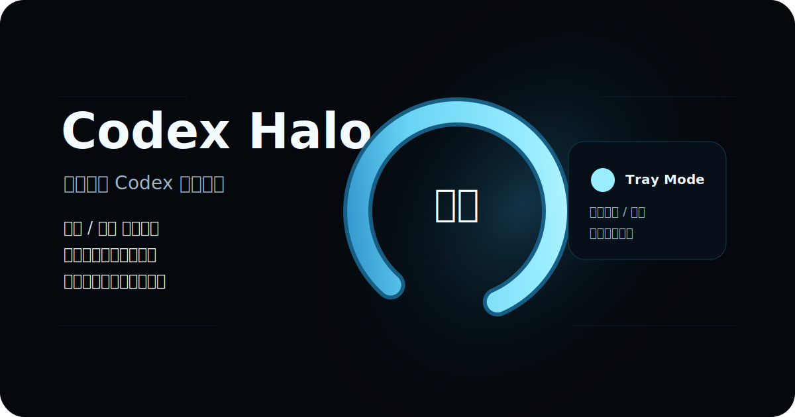
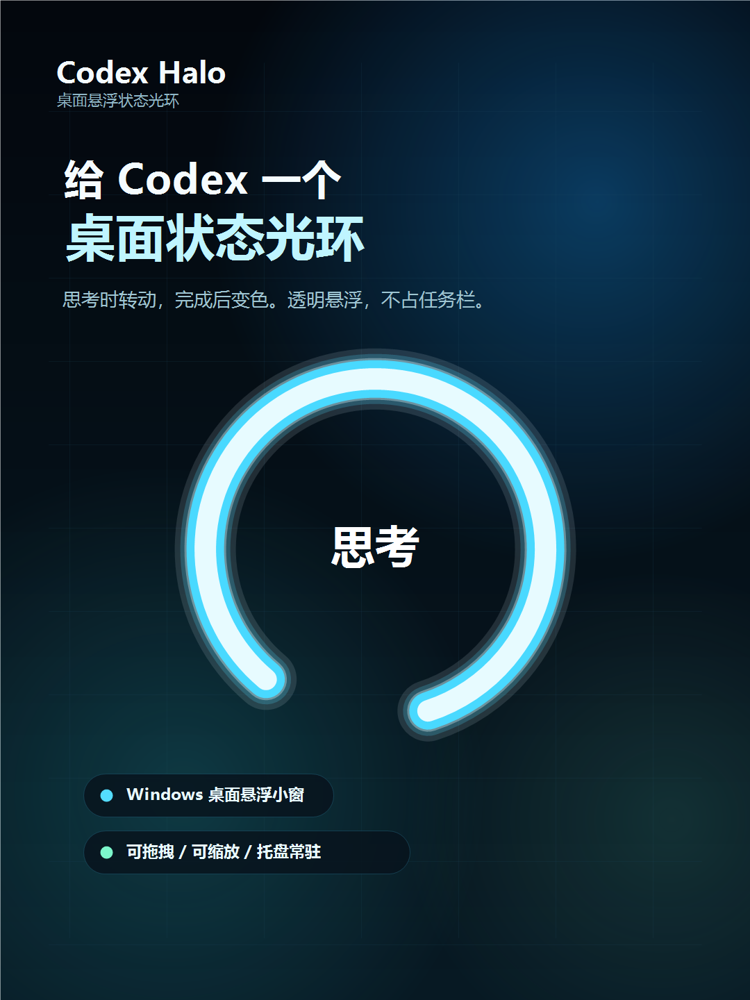
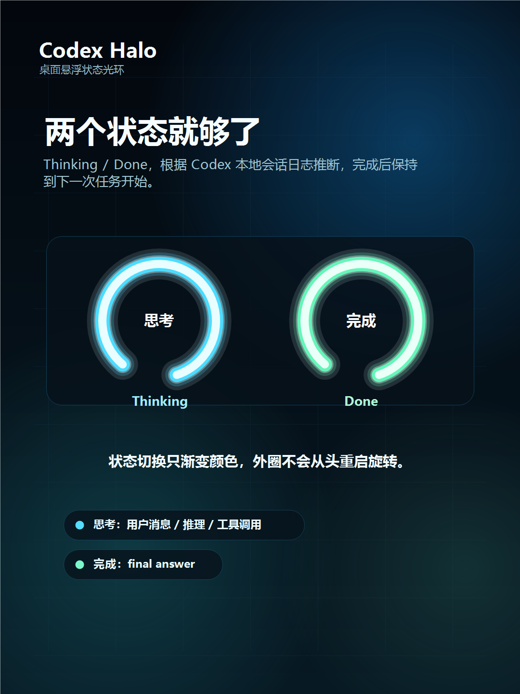
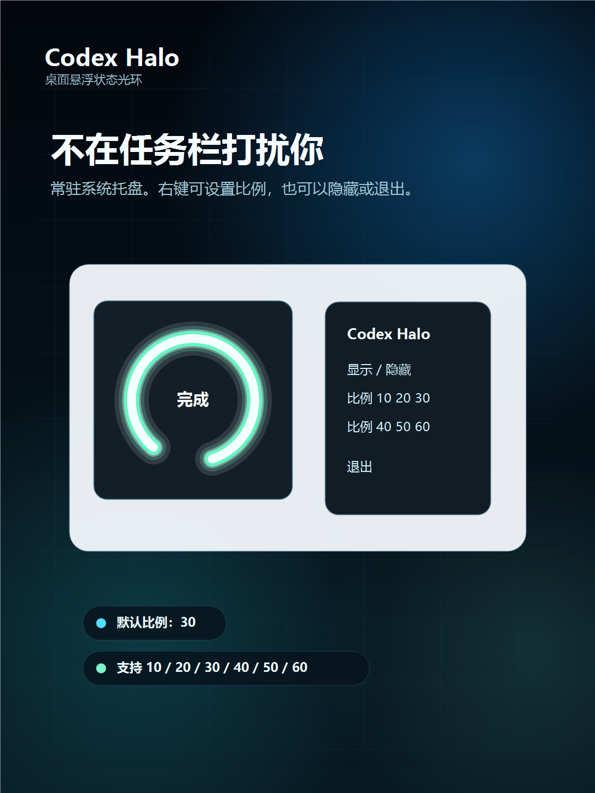
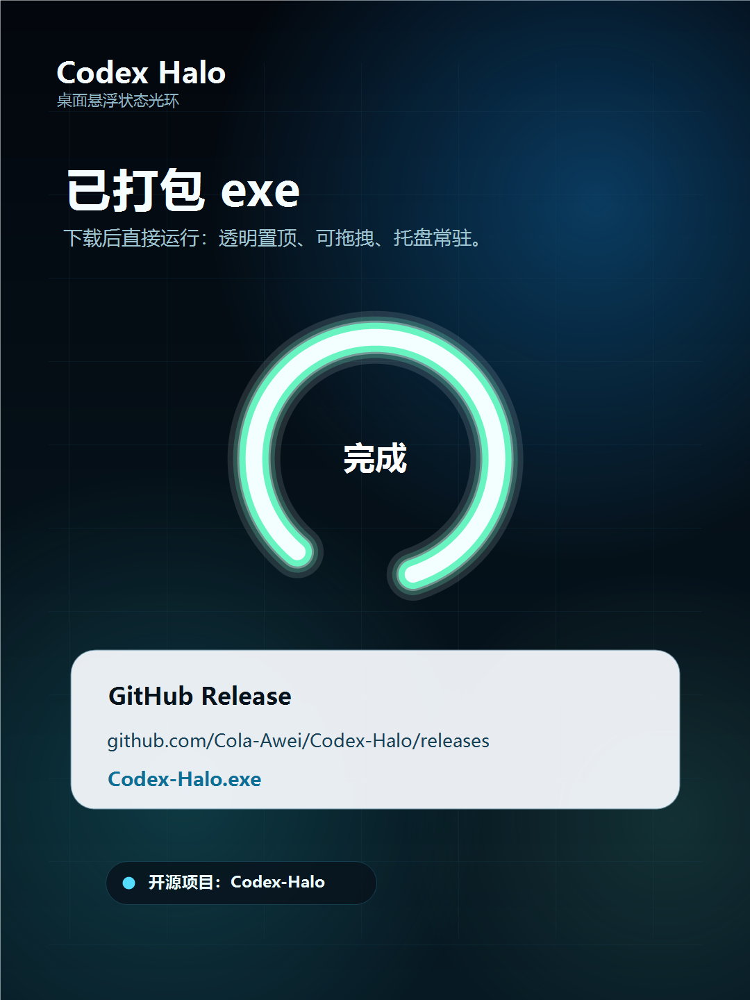

# Codex Halo



Codex Halo 是一个 Windows 桌面悬浮状态小窗。它用一个可拖拽的 C 形光环显示 Codex 当前状态：思考时旋转，完成后变色。

悬浮窗透明置顶，不占任务栏；程序常驻系统托盘，右键可以打开漂亮的滑杆面板调整大小，也可以隐藏或退出。

## 功能

- 两种状态：`思考` / `完成`
- 读取本地 Codex session JSONL 日志推断状态
- C 形 SVG 圆角光环，外圈持续旋转
- 状态切换时只渐变颜色，不重置旋转动画
- 中心只显示白色中文状态字
- 悬浮窗可拖拽，透明置顶
- 系统托盘常驻，不显示任务栏图标
- 右键打开大小滑杆，支持 `0-100%` 连续调整
- 缩放会同步修改真实窗口大小，缩小后不会留下旧尺寸透明命中区
- 托盘菜单支持显示/隐藏、设置大小、退出
- 支持打包为 Windows 单文件便携版 `.exe`

## 预览图

小红书介绍图已经放在 `docs/xiaohongshu/`：









## 状态规则

Codex 目前没有公开稳定的实时状态 API，本项目通过读取本机 `.codex/sessions/**/*.jsonl` 推断状态。

- `user_message`、`reasoning`、`function_call`、工作中的 `commentary` -> `思考`
- `final_answer` -> `完成`
- `完成` 会保持到下一次新的任务事件开始

## 使用

```bash
npm install
npm start
```

## 打包 Windows exe

```bash
npm run build:win
```

打包产物：

```text
dist/Codex-Halo.exe
```

## 下载

GitHub Releases：

```text
https://github.com/Cola-Awei/Codex-Halo/releases
```

当前便携版文件名：

```text
Codex-Halo.exe
```

## 开发验证

```bash
npm test
```

## 项目结构

```text
src/main/        Electron 主进程、托盘、状态监听、窗口配置
src/renderer/    悬浮窗 UI、右键滑杆面板、拖拽、光环样式
src/shared/      状态模型
tests/           Node test 测试
docs/images/     README 介绍图
docs/xiaohongshu 小红书介绍图
scripts/         辅助生成脚本
```

## 注意

状态监听依赖本地 Codex session 日志，因此它是实用型推断方案，不等同于官方实时状态 API。
